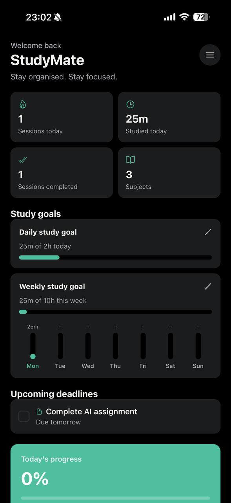
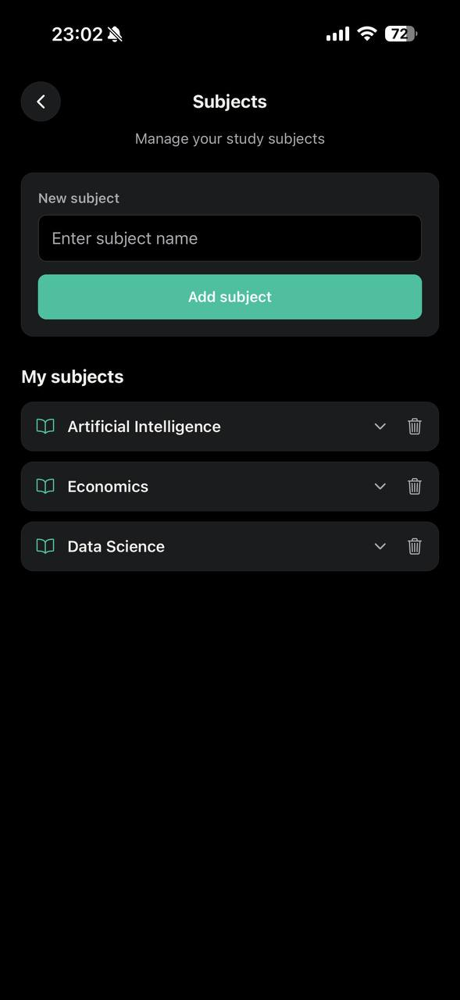
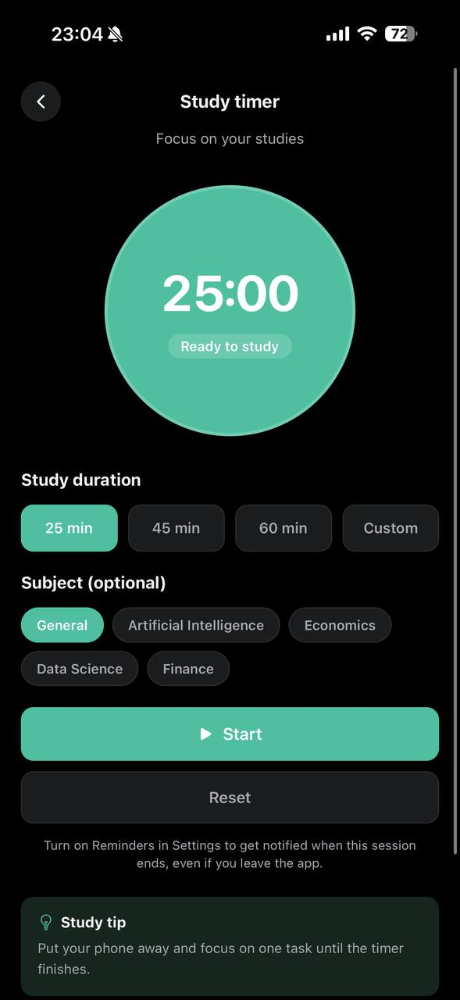
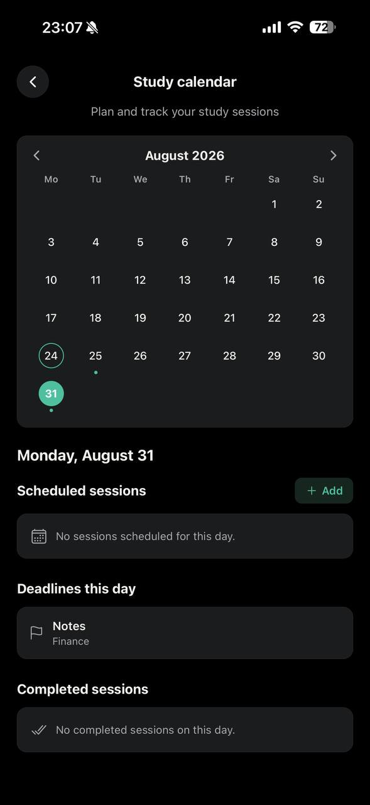
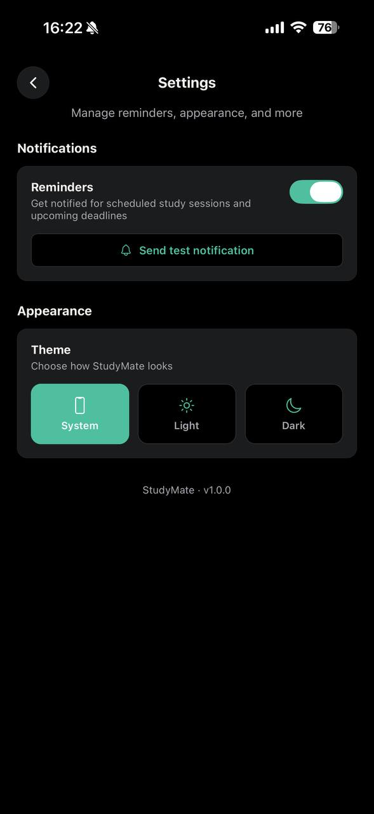

# StudyMate

A study companion app built with Expo, that lets users keep track of homework, assignments and tests, manage their subjects, a study timer, study sessions planner, set study goals and receive reminders.

## Features

Overview Screen (Dashboard/Home): number of sessions, hours spent studying, progress, deadlines approaching, plus a week chart. A burger menu in the top-right corner leads to all other screens.

Tasks: general tasks, assignments, tests, each with an optional subject and a due date.

Subjects: tasks organized by subject with a weekly study goal per subject.

Study Timer: customizable or preset time, optionally linked to a subject; tracks real time to count toward your session so that it cannot be fooled by suspending the app or putting your phone to sleep; automatically logs a completed session upon finishing a session, and if you've enabled reminders, you'll get a local notification the moment a session ends even if you were not using the app.

Calendar: select a date to view your scheduled sessions, deadlines due on that date, and sessions completed on that date; schedule a session with an optional time.

Goals: daily, weekly, and per-subject hour goals with progress bars.

Reminders: local notifications for upcoming deadlines, scheduled study sessions, and completed timers.

Settings: enable/disable reminders and set a theme (System / Light / Dark).

All your tasks, subjects, sessions, and preferences are stored locally on your device for convenience and privacy and are preserved after restarting the app.

## Screenshots

| | |
|---|---|
| <br>**Home** — today's stats, study goals, and upcoming deadlines | <br>**Subjects** — tasks grouped by subject, each with its own weekly goal |
| <br>**Study Timer** — preset or custom countdown, optionally tagged to a subject | <br>**Study Calendar** — scheduled sessions, deadlines, and completed sessions by date |
| <br>**Settings** — reminders toggle and theme (System / Light / Dark) | |

Navigation flow: the hamburger icon at the top-right of Home screen opens a drop-down menu with links to Subjects, Study timer, Study calendar, and Settings. All other screens have a back button (top-left) that takes the user back to the Home screen.

## Requirements

- [Node.js](https://nodejs.org/) (LTS)
- npm
- The [Expo Go](https://expo.dev/go) app on your phone (iOS or Android) The Expo Go app that you install from the App/Play Store needs to support Expo SDK 54, which this project targets.

## Setup

```bash
npm install
```

## Running the app

```bash
npx expo start
```

Wait for `Waiting on http://localhost:8081` in the terminal, then either:

To view your React Native project run on your phone, follow these steps:

1. Scan the QR code shown on your terminal using your phone's camera (iOS) or the Expo Go app (Android)

or

2. Open Expo Go on your phone. If you're logged in to the same Expo account you used to start the project, your project should appear in your "Recently in development" projects

or

3. Manually enter exp://:8081 in Expo Go/Safari (see below how to find your IP)


Make sure your phone is connected to the same Wi-Fi network as your computer.

## Technologies Used

- [Expo SDK 54](https://docs.expo.dev/versions/v54.0.0/) / React Native 0.81
- [Expo Router](https://docs.expo.dev/router/introduction/) (file-based routing, screens under `src/app/`)
- TypeScript
- `@react-native-async-storage/async-storage` for on-device persistence
- `@react-native-community/datetimepicker` for date/time pickers
- `expo-notifications` for local reminders
- `@expo/vector-icons` (Ionicons)

## Linting

```bash
npx expo lint
```
